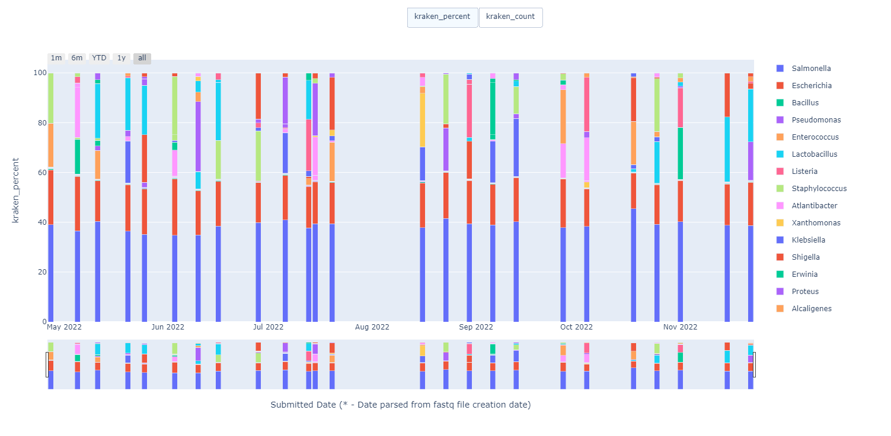

<!-- control tracker documentation master file, created by
sphinx-quickstart on Wed Oct 26 09:44:19 2022.
You can adapt this file completely to your liking, but it should at least
contain the root `toctree` directive. -->
# Welcome to control tracker’s documentation!

This project was created to parse the output of bioinformatics tools on an Irida project using its ```parse``` command and store that output in a local SQLite database. It can then create seperate time series html files (example below) for each class of sample from the project using its ```report``` command.




# Installation

1. Create a folder to hold everything.
```shell
mkdir ControlsTracker
cd ControlsTracker
```

2. Clone the git repository.
```shell
git clone https://github.com/landowark/control_tracker.git .
```

3. Create virtual environment and install required python packages.
```shell
conda create --name <env> --file requirements.txt
```

4. Activate virtual environment.
```shell
conda activate <env>.
```

5. Install refseq_masher if it failed to install during virtual environment creation.
```shell
pip install refseq_masher
```
(For the life of me I could not get this to work with conda.)


6. Initialize the sqlite3 database.
```shell
alembic upgrade head
```

7. Edit 'config_dummy.yml' and save as 'config.yml'. You might have to get it from me.

8. Create control types in the database.
```shell
python controls DBinit
```

# Usage.

## controls

```shell
controls [OPTIONS] COMMAND [ARGS]...
```

### Options


### -v, --verbose
Set logging level to DEBUG if true.


### -c, --config <_config_>
Path to config.yml. If blank defaults to first found of ~/.config/controls/config.yml, ~/.controls/config.yml or controls/config.yml

### DBinit

```shell
controls DBinit [OPTIONS]
```

### parse

Pulls fastq files from Irida, runs refseq_masher and stores results.

```shell
controls parse [OPTIONS]
```

### Options


### -s, --storage <_storage_>
Folder for storage of fastq files. Overwrites config.yml path.


### --mode <_mode_>
Refseq_masher mode to be run. Defaults to ‘both’.


* **Options**

    contains | matches | kraken | all


### report

Generates html and xlsx reports.

```shell
controls report [OPTIONS]
```

### Options


### -o, --output_dir <_output_dir_>
Folder for storage of reports. Overwrites config.yml path.

# Configuration file.

This file stores the configuration that will be used by the program and must be filled in by the user.
Fill in values before the ‘#’ in config_dummy.yml and save as config.yml in the same folder.

```yaml
# custom join statement defined in setup.__init__ 

# <> must be replaced with user generated values.

modes: #: external programs used to parse data
  <mode>: #: [List of relevant columns generated for mode in database]
irida:
  project_number: #: Project id assigned by irida
  project_name: #: Project name assigned by irida
  username: #: Username for irida permissions
  password: #: Password for irida permissions
  storage: #: Location to store irida shortcuts (only used if not overridden in command line options)
kraken2:
  db_path: #: location of kraken2 database on server
folder:
  # custom join statement defined in setup.__init__ 
  output: #: Where xlsx and html output files from reports will be stored.
  old_db_path: #: Location of old database export file for retrieving dates. Not necessary if date in sample name.
control_types: #: Archetypes of control samples
  <controltype>: #: Control archetype name. 
    targets: #: [List of target genera for control type]
    regex: #: Regular expression used to parse this control type
date_regex: #: Regular expression used to parse submission date.
rerun_regex: #: Regular expression used to parse whether a sample is a rerun
```


<!-- # Usage.

## controls

```shell
controls [OPTIONS] COMMAND [ARGS]...
```

### Options


### -v, --verbose
Set logging level to DEBUG if true.


### -c, --config <_config_>
Path to config.yml. If blank defaults to first found of ~/.config/controls/config.yml, ~/.controls/config.yml or controls/config.yml

### DBinit

```shell
controls DBinit [OPTIONS]
```

### parse

Pulls fastq files from Irida, runs refseq_masher, kraken2 and stores results.

```shell
controls parse [OPTIONS]
```

### Options


### -s, --storage <_storage_>
Folder for storage of fastq files. Overwrites config.yml path.


### --mode <_mode_>
Refseq_masher mode to be run. Defaults to ‘all’.


* **Options**

    contains | matches | kraken | all


### report

Generates html and xlsx reports.

```shell
controls report [OPTIONS]
```

### Options


### -o, --output_dir <_output_dir_>
Folder for storage of reports. Overwrites config.yml path.

# Configuration file.

This file stores the configuration that will be used by the program and must be filled in by the user.
Fill in values before the ‘#’ in config_dummy.yml and save as config.yml in the same folder.

```yaml
# <> must be replaced with user generated values

modes: #: external programs used to parse data
  <mode>: #: [List of relevant columns generated for mode in database]
irida:
  project_number: #: Project id assigned by irida
  project_name: #: Project name assigned by irida
  username: #: Username for irida permissions
  password: #: Password for irida permissions
  storage: #: Location to store irida shortcuts (only used if not overridden in command line options)
kraken2:
  db_path: #: location of kraken2 database on server
folder:
  # custom join statement defined in setup.__init__ 
  output: #: Where xlsx and html output files from reports will be stored.
  old_db_path: #: Location of old database export file for retrieving dates. Not necessary if date in sample name
control_types: #: Archetypes of control samples
  <controltype>: #: Control archetype name
    targets: #: [List of target genera for control type]
    regex: #: Regular expression used to parse this control type
date_regex: #: Regular expression used to parse submission date
rerun_regex: #: Regular expression used to parse whether a sample is a rerun
``` -->
